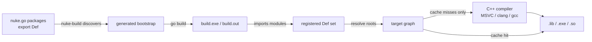
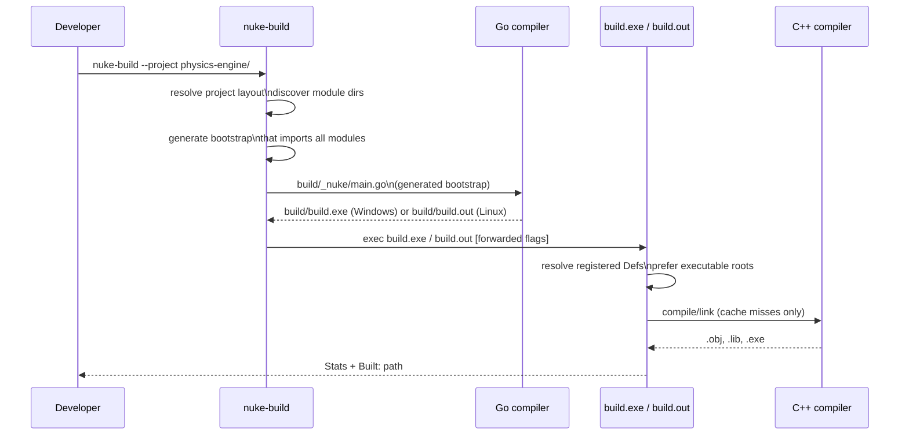

# Architecture

This document covers internal architecture details that are intentionally kept out of the top-level quickstart flow.

## High-level model

- Build declarations are Go packages that export `Def` values.
- `nuke-build` discovers module packages and generates a temporary bootstrap under `build/_nuke/`.
- The bootstrap imports discovered packages, resolves registered target declarations, and builds executable roots.
- The build graph is evaluated as artifact sets with content-addressed caching.

## Two-phase pipeline

## Graph and configuration semantics

- `LinkPublic` propagates public config transitively to dependents.
- `LinkPrivate` uses dependency public config when compiling this target but does not propagate it further.
- Include/config scope in fluent DSL defaults to public.
- Call `Private()` to switch scope for subsequent `With*` config calls.
- Call `Public()` to switch scope back.

## Build directory contract

- Generated bootstrap files are under `build/_nuke/`.
- Build outputs (objects/libs/exes/cache DB) are under the resolved build root.
- Source tree should remain read-only for nuke-build execution.

## Related docs

- Quickstart and first-run workflow: [README.md](README.md#quickstart)
- Full API and CLI reference: [USERGUIDE.md](USERGUIDE.md)
