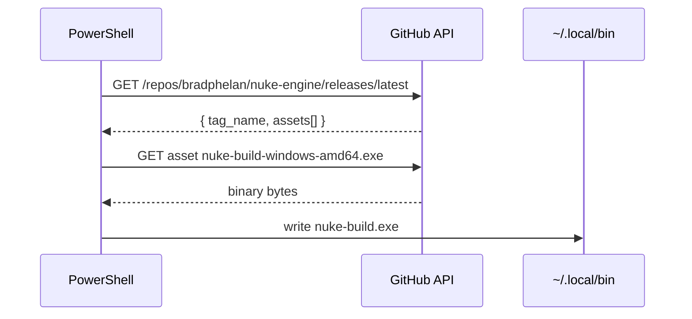

# Installing nuke-build

## Prerequisites

- Windows 10/11 with Visual Studio 2019 or 2022 (for the MSVC back-end)
- Go 1.21+ is **not** required on client machines — `nuke-build` is a standalone binary

---

## One-line install (Windows)

Open a PowerShell prompt and run:

```powershell
iex (irm https://raw.githubusercontent.com/bradphelan/nuke-engine/main/install.ps1)
```

The script:
1. Fetches the latest release tag from the GitHub API
2. Downloads the `windows-amd64` binary
3. Saves it to `~\.local\bin\nuke-build.exe`



### Add to PATH

The script prints a reminder if `~\.local\bin` is not on your PATH. To persist it:

```powershell
[System.Environment]::SetEnvironmentVariable(
    "PATH",
    "$env:USERPROFILE\.local\bin;$([System.Environment]::GetEnvironmentVariable('PATH','User'))",
    "User"
)
```

Restart your terminal, then verify:

```powershell
nuke-build --version
```

---

## One-line install (Linux / macOS)

```sh
curl -sSfL https://raw.githubusercontent.com/bradphelan/nuke-engine/main/install.sh | sh
```

Binary is placed at `~/.local/bin/nuke-build`. Add to PATH if needed:

```sh
export PATH="$HOME/.local/bin:$PATH"   # add to ~/.bashrc or ~/.zshrc
```

---

## Install from source

Requires Go 1.21+.

```sh
git clone https://github.com/bradphelan/nuke-engine
go install github.com/bradphelan/nuke-engine/cmd/nuke-build@latest
```

Or build locally:

```sh
go build -o ~/.local/bin/nuke-build ./cmd/nuke-build
```

---

## Upgrading

Re-run the one-liner. It always fetches the latest release.

---

## Uninstalling

Delete the binary:

```powershell
Remove-Item "$env:USERPROFILE\.local\bin\nuke-build.exe"
```

```sh
rm ~/.local/bin/nuke-build
```
