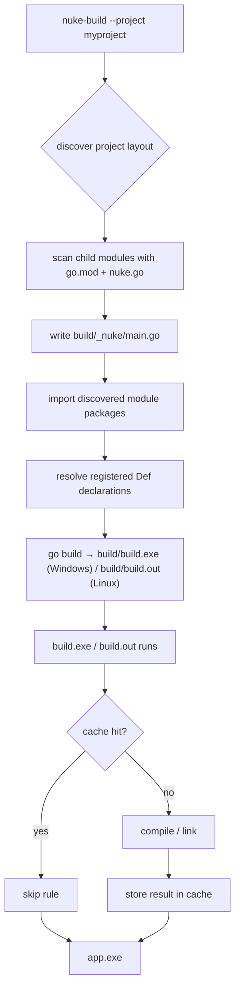

# Quickstart

Build a C++ executable from scratch in under five minutes.

> **Prerequisites**: `nuke-build` installed ([INSTALL.md](INSTALL.md)), Visual Studio 2019/2022 on PATH.

---

## 1. Project layout

```
myproject/
├── go.work          (Go workspace — ties modules together)
├── app/
│   ├── go.mod       (module: myproject)
│   ├── nuke.go      (build rules)
│   └── src/
│       └── main.cpp
```

---

## 2. Create the source file

```cpp
// app/src/main.cpp
#include <cstdio>
int main() { std::puts("hello from nuke!"); }
```

---

## 3. Create the Go module

```
# app/go.mod
module myproject

go 1.21
```

---

## 4. Write the build rules

```go
// app/nuke.go
package app

import (
    "github.com/bradphelan/nuke-engine/cpp"
)

var Def = cpp.Define(func(self cpp.Self) *cpp.Target {
    return self.Exe().
        Sources(self.Glob("src/**/*.cpp"))
})
```

`Def` is the package's exported target declaration. Inside the callback,
`self` is a bound helper created from that declaration plus the current build
context, so you can ask for its derived directory and create the right target
kind without repeating the package name or passing `ctx` around.

If you split code into libraries, set **public** include paths for consumers and
**private** include paths for implementation details:

```go
// mathcore/nuke.go
package mathcore

import (
    "path/filepath"

    "github.com/bradphelan/nuke-engine/compiler"
    "github.com/bradphelan/nuke-engine/cpp"
)

var Def = cpp.Define(func(self cpp.Self) *cpp.Target {
    return self.StaticLib().
        PublicConfig(compiler.New().WithIncludeDir(filepath.Join(self.Dir(), "include"))).
        PrivateConfig(compiler.New().WithIncludeDir(filepath.Join(self.Dir(), "src", "internal"))).
        Sources(self.Glob("src/**/*.cpp"))
})
```

`PublicConfig` propagates to dependents. `PrivateConfig` is used only while
compiling this target.

---

## 5. Create the workspace

```
# go.work
go 1.21

use (
    ./app
)
```

---

## 6. Build

```powershell
nuke-build --project myproject
```

You can also point directly at the module package:

```powershell
nuke-build --project myproject/app
```

For this simple layout, both commands resolve the same build root.

First run compiles everything:

```
Stats: cache_hits=0 cache_misses=3 rules_executed=3 outputs=1
Tasks executed: 3
Built: file:///.../myproject/build/bin/app.exe
```

Run again — nothing to do:

```
Stats: cache_hits=3 cache_misses=0 rules_executed=0 outputs=1
No tasks need running (up-to-date).
Built: file:///.../myproject/build/bin/app.exe
```

---

## What just happened?



The generated `build/` directory is safe to delete at any time — it is never part of your source tree.

---

## Next steps

- Add a static library dependency → [USERGUIDE.md § Static libraries](USERGUIDE.md#static-libraries)
- Customise include paths, defines, and C++ standard → [USERGUIDE.md § Compiler config](USERGUIDE.md#compiler-config)
- Multi-module workspace layout → [USERGUIDE.md § Multi-module projects](USERGUIDE.md#multi-module-projects)
