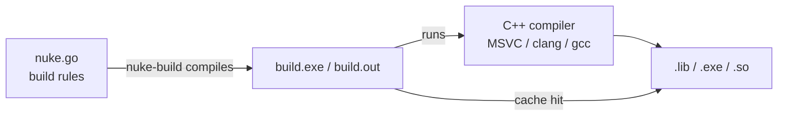

# nuke-engine

A content-addressed, incremental C++ build system written in Go. Build rules are plain Go code — no DSL, no YAML, no magic.



## Key ideas

- **Build rules are Go code.** A `nuke.go` file in your project declares targets using the nuke-engine API. No special syntax to learn.
- **Content-addressed cache.** Outputs are fingerprinted by their inputs. A rebuild only runs rules whose inputs changed.
- **Two-phase execution.** `nuke-build` first compiles your `nuke.go` into a self-contained `build.exe` (Windows) / `build.out` (Linux/macOS) binary, then runs it. The source tree is never modified.
- **Dependency discovery.** On MSVC the `/showIncludes` flag is used to record discovered headers; subsequent builds re-fingerprint them automatically.

## Docs

| Document | What it covers |
|---|---|
| [INSTALL.md](INSTALL.md) | Installing `nuke-build` on your machine |
| [QUICKSTART.md](QUICKSTART.md) | Your first project in five minutes |
| [USERGUIDE.md](USERGUIDE.md) | Full reference — targets, config, cache, CLI |

## Supported platforms / toolchains

| Platform | Toolchain | Status |
|---|---|---|
| Windows | MSVC (VS 2019 / 2022) | ✅ |
| Linux | GCC / Clang | planned |
| macOS | Clang | planned |

## Quick example

```go
// myproject/app/nuke.go
package app

import (
    "github.com/bradphelan/nuke-engine/artifact"
    "github.com/bradphelan/nuke-engine/compiler"
    "github.com/bradphelan/nuke-engine/cpp"
    "github.com/bradphelan/nuke-engine/target"
    "path/filepath"
)

func Build(builder *cpp.CppBuilder, baseCfg compiler.Config, rootDir string) *target.Target[compiler.Config] {
    return cpp.NewExe("app", builder, baseCfg).
        Sources(artifact.Glob(filepath.Join(rootDir, "app", "src"), "**/*.cpp"))
}
```

```sh
nuke-build --project myproject/app
```

## License

MIT
