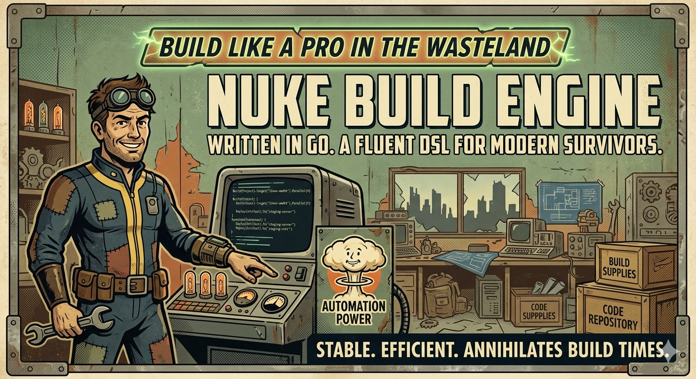
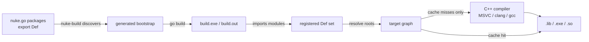

# nuke-engine

Build C++ with plain Go.

`nuke-engine` is a replacement for CMake + Ninja when you want your build logic to be real Go code. Define C++ targets in code, compose them across modules, and get content-addressed incremental builds without a separate DSL.

It is type-safe and IDE/IntelliSense friendly. No more string-bashing macros or brittle CMake generator expressions. You can use full Go language features, normal tooling, and refactoring support for your build logic.

<p align="center">
    <a href="docs/nuke.jpg">
        
    </a>
</p>

<p align="center">
    <sub><strong>Nuke Build Engine</strong> - Build like a pro in the wasteland.</sub>
</p>

## Quick example

```go
// myproject/app/nuke.go
package app

import (
    "github.com/bradphelan/nuke-engine/cpp"

    "myproject/mathcore"
    "myproject/simulation"
)

var Def = cpp.Define(func(self cpp.Self) *cpp.Target {
    return self.Exe().
        LinkPublic(mathcore.Def).
        LinkPrivate(simulation.Def).
        Sources(self.Glob("src/**/*.cpp"))
})
```

```sh
nuke-build --project myproject
```

That one command will:

1. Discover your build modules.
2. Generate a temporary bootstrap under `build/_nuke/`.
3. Import all discovered module packages.
4. Resolve registered `Def` declarations.
5. Build executable roots and their transitive dependencies.

## Why this is better than another build DSL

- Build rules are normal Go code, so composition and refactoring are just code.
- C++ targets link by importing sibling modules and referencing exported `Def` values.
- Incremental rebuilds are automatic because outputs are fingerprinted from their inputs.
- The generated bootstrap lives in `build/`, not in your source tree.
- A workspace root can contain multiple executables; `nuke-build` will discover them and build executable roots by default.

## Core model

- Each build module exports one package-level `Def`.
- `cpp.Define(...)` stores the declaration and registers it when the package is imported.
- Inside the callback, `self` is a context-bound helper for the current module.
- `self.Exe()`, `self.StaticLib()`, and `self.SharedLib()` declare target kind.
- `LinkPublic(other.Def)` and `LinkPrivate(other.Def)` express target graph edges.
- `self.Glob("src/**/*.cpp")` resolves sources relative to the module directory.



## Common commands

```sh
# Build from a specific module package
nuke-build --project myproject/app

# Build from a workspace root containing child modules
nuke-build --project myproject
```

Both forms are valid. In workspace-root mode, `nuke-build` imports all discovered child modules and resolves every registered `Def`.

## Docs

| Document | What it covers |
|---|---|
| [INSTALL.md](INSTALL.md) | Installing `nuke-build` on your machine |
| [QUICKSTART.md](QUICKSTART.md) | Your first project in five minutes |
| [USERGUIDE.md](USERGUIDE.md) | Full reference — targets, config, cache, CLI |

## Supported platforms / toolchains

| Platform | Toolchain | Status |
|---|---|---|
| Windows | MSVC (VS 2019 / 2022) | ✅ |
| Linux | GCC / Clang | planned |
| macOS | Clang | planned |

## License

MIT
