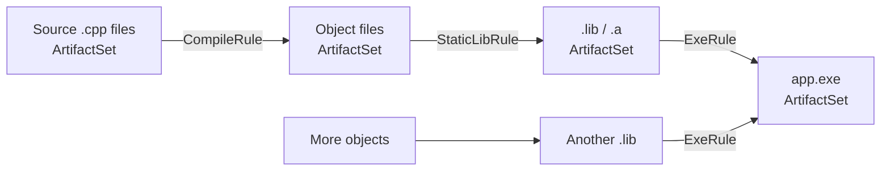
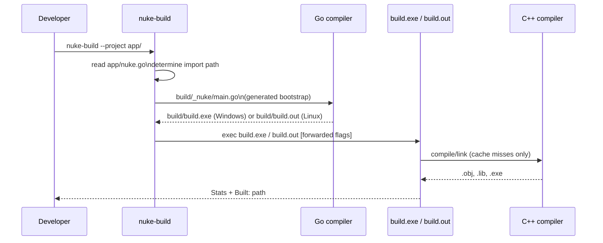
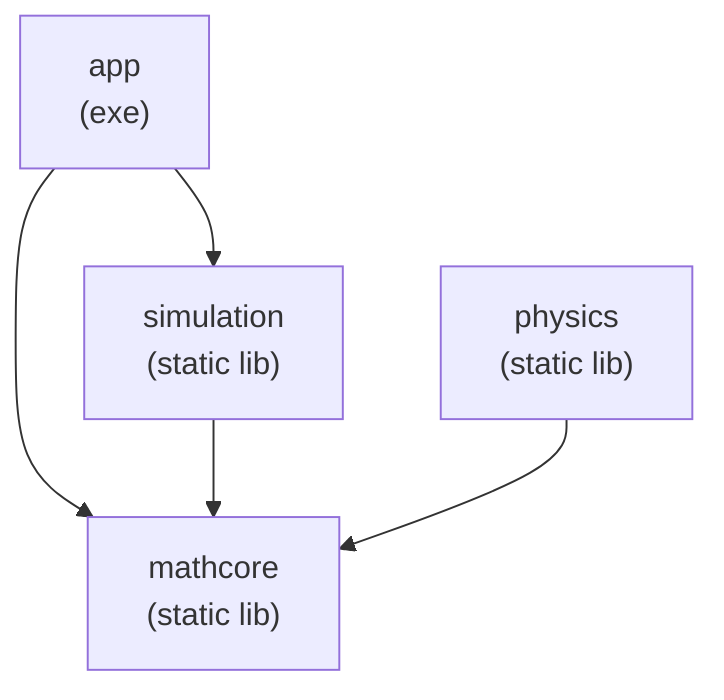
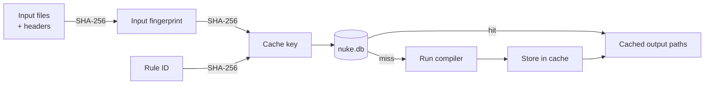

# User Guide

## Table of contents

- [Concepts](#concepts)
- [Project structure](#project-structure)
- [Target types](#target-types)
  - [Executable](#executable)
  - [Static libraries](#static-libraries)
  - [Shared libraries](#shared-libraries)
- [Compiler config](#compiler-config)
- [Linking targets together](#linking-targets-together)
- [Multi-module projects](#multi-module-projects)
- [Build directory](#build-directory)
- [CLI reference](#cli-reference)
- [Caching](#caching)
- [How nuke-build works internally](#how-nuke-build-works-internally)

---

## Concepts

nuke-engine models a build as a **graph of artifact sets**.



Every node in the graph is an `ArtifactSet`. The engine walks the graph, fingerprints each node's inputs, and only re-runs rules whose inputs have changed. Results are stored in a content-addressed BoltDB cache.

### Two-phase build



The generated bootstrap in `build/_nuke/` is **ephemeral** — it is regenerated every time and lives entirely inside the build directory.

---

## Project structure

The minimal layout for a single-binary project:

```
myproject/
├── go.work
├── app/
│   ├── go.mod      # module name used as import path
│   ├── nuke.go     # package <name>, exports Def
│   └── src/
│       └── *.cpp
```

The package-level `Def` declaration is the entrypoint. The common shape is:

```go
var Def = cpp.Define(func(self cpp.Self) *cpp.Target {
    return self.Exe().
        Sources(self.Glob("src/**/*.cpp"))
})
```

`Def` is the stored package-level declaration. `self` is a thin bound helper
created from `(Def + current build context)` when the declaration is realized.
It gives you helpers like `Dir`, `Glob`, `Name`, `Exe`, `StaticLib`, and
`SharedLib` without requiring the callback to thread `ctx` through every call.

`self.RootDir()` is the **parent** of the project directory. `self.Dir()` is the
usual way to get this module's absolute path. Use `self.RootDir()` when you need to
refer to sibling modules explicitly.

```go
dir := self.Dir()                            // this module's directory
siblingDir := filepath.Join(self.RootDir(), "lib") // a sibling module
```

---

## Target types

### Executable

```go
self.Exe().
    Sources(self.Glob("src/**/*.cpp"))
```

Output: `build/bin/myapp.exe` (Windows) / `build/bin/myapp` (Linux/macOS).

### Static libraries

```go
self.StaticLib().
    PublicConfig(compiler.New().WithIncludeDir(filepath.Join(dir, "include"))).
    PrivateConfig(compiler.New().WithIncludeDir(filepath.Join(dir, "src", "internal"))).
    Sources(self.Glob("src/**/*.cpp"))
```

- **`PublicConfig`** — include dirs/defines that consumers inherit automatically when they link against this library.
- **`PrivateConfig`** — include dirs/defines used only when compiling this library itself.

### Shared libraries

```go
self.SharedLib().
    Sources(self.Glob("src/**/*.cpp"))
```

Output: `build/bin/mylib.dll` / `build/bin/libmylib.so`.

---

## Compiler config

`compiler.Config` is an immutable value type. Every `With*` method returns a new copy.

```go
cfg := compiler.New().
    WithStandard(compiler.Cpp20).
    WithBuildType(compiler.Release).
    WithDefine("NDEBUG").
    WithIncludeDir("/usr/local/include").
    WithCFlag("-Wall")
```

| Method | Values |
|---|---|
| `WithStandard` | `C17`, `Cpp17`, `Cpp20`, `Cpp23` |
| `WithBuildType` | `Debug`, `Release`, `RelWithDebInfo` |
| `WithDefine(s)` | any preprocessor define string |
| `WithIncludeDir(p)` | absolute or relative path |
| `WithCFlag(f)` | raw compiler flag |
| `WithLDFlag(f)` | raw linker flag |

Config is **merged** transitively. When target A links against library B, B's `PublicConfig` is merged into A's effective config automatically.


---

## Linking targets together

```go
var Def = cpp.Define(func(self cpp.Self) *cpp.Target {
    return self.Exe().
        LinkPublic(mathcore.Def).   // mathcore's public config propagates
        LinkPrivate(simulation.Def). // simulation's public config stays private
        Sources(self.Glob("src/**/*.cpp"))
})
```

`LinkPublic` vs `LinkPrivate` only matters when the target is itself a library consumed by something else. For a final executable both behave identically.

When you pass `mathcore.Def` to `LinkPublic`, the fluent `*cpp.Target` resolves
that declaration internally using the active `ctx`. You do not need to call
`Resolve(ctx)` explicitly in module code.

---

## Multi-module projects

Large projects split into Go modules so that modules can be versioned and imported independently.

```
physics-engine/
├── go.work
├── mathcore/
│   ├── go.mod   (module physics_engine/mathcore)
│   └── nuke.go
├── physics/
│   ├── go.mod   (module physics_engine/physics)
│   └── nuke.go
└── app/
    ├── go.mod   (module physics_engine)
    └── nuke.go  ← entry point exports Def
```

The `go.work` file ties them together during development:

```
go 1.21

use (
    ./mathcore
    ./physics
    ./app
)
```

The entry-point `app/nuke.go` imports sibling modules by their module path:

```go
import (
    "physics_engine/mathcore"
    "physics_engine/physics"
)
```

and links their exported declarations directly:

```go
var Def = cpp.Define(func(self cpp.Self) *cpp.Target {
    return self.Exe().
        LinkPublic(mathcore.Def).
        LinkPrivate(physics.Def).
        Sources(self.Glob("src/**/*.cpp"))
})
```



`nuke-build` discovers the workspace by reading `go.mod` files and generates a temporary `go.work` with absolute paths so that the bootstrap can be compiled from any working directory.

---

## Build directory

By default outputs go to `<workspace-parent>/build/`:

```
physics-engine/
├── app/
├── mathcore/
└── build/               ← generated here
    ├── _nuke/           ← ephemeral bootstrap (safe to delete)
    │   ├── main.go
    │   ├── go.mod
    │   └── go.work
    ├── build.exe        ← compiled builder (Windows)
    ├── build.out        ← compiled builder (Linux/macOS)
    ├── obj/             ← compiled objects
    ├── lib/             ← static/shared libraries
    ├── bin/             ← executables
    └── nuke.db          ← content-addressed cache
```

Override with `--build-dir`:

```sh
nuke-build --project app --build-dir /tmp/mybuild
```

Everything under `build/` is **fully reproducible** from source. Add it to `.gitignore`.

---

## CLI reference

```
nuke-build [flags]

Flags:
  --project <dir>    Path to the directory containing nuke.go  (required)
  --build-dir <dir>  Output directory (default: <project-parent>/build)
  --version          Print version and exit
  -h / --help        Show this help

Forwarded to build.exe / build.out:
  --tree                    Print dependency tree and exit
  --tree-graphvis           Print dependency DAG as Graphviz DOT and exit
  --tree-graphviz           Alias for --tree-graphvis
  --compile-commands        Write compile_commands.json and exit
  --compile-commands.json   Alias for --compile-commands
```

Any flag not recognised by `nuke-build` itself (`--project`, `--build-dir`, `--version`) is passed through verbatim to `build.exe` / `build.out`.

### Exit codes

| Code | Meaning |
|---|---|
| 0 | Build succeeded (or up-to-date) |
| 1 | Build error or configuration problem |

### Output format

```
Stats: cache_hits=N cache_misses=N rules_executed=N outputs=N
No tasks need running (up-to-date).   ← when rules_executed == 0
Tasks executed: N                     ← otherwise
Built: file:///path/to/output
```

---

## Caching

nuke-engine uses a **content-addressed** cache backed by [bbolt](https://github.com/etcd-io/bbolt).



### What counts as an input

- All `.cpp` source files listed in `Sources()`
- All headers discovered via `/showIncludes` (MSVC) on the first compile
- The compiler rule ID (encodes flags, standard, build type)

### When the cache is invalidated

- A source file changes (content hash changes)
- A discovered header changes
- Compiler flags change (different rule ID)
- The output file is deleted or modified outside the build system

The cache database (`nuke.db`) lives in the build directory. Delete it to force a full rebuild:

```sh
Remove-Item build/nuke.db    # Windows
rm build/nuke.db             # Linux/macOS
```
